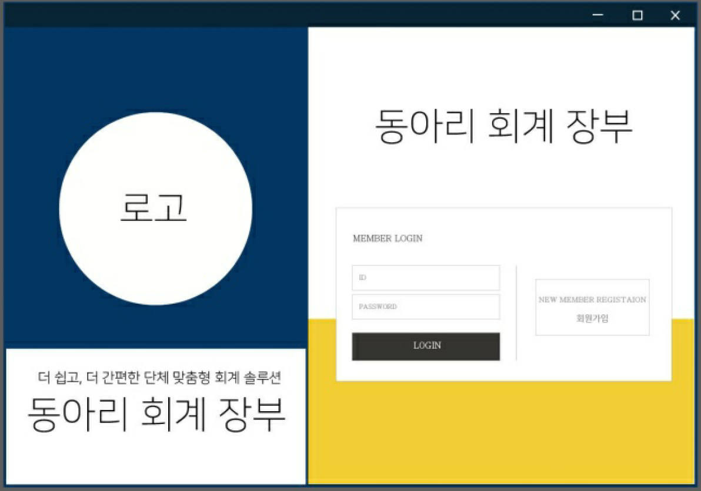
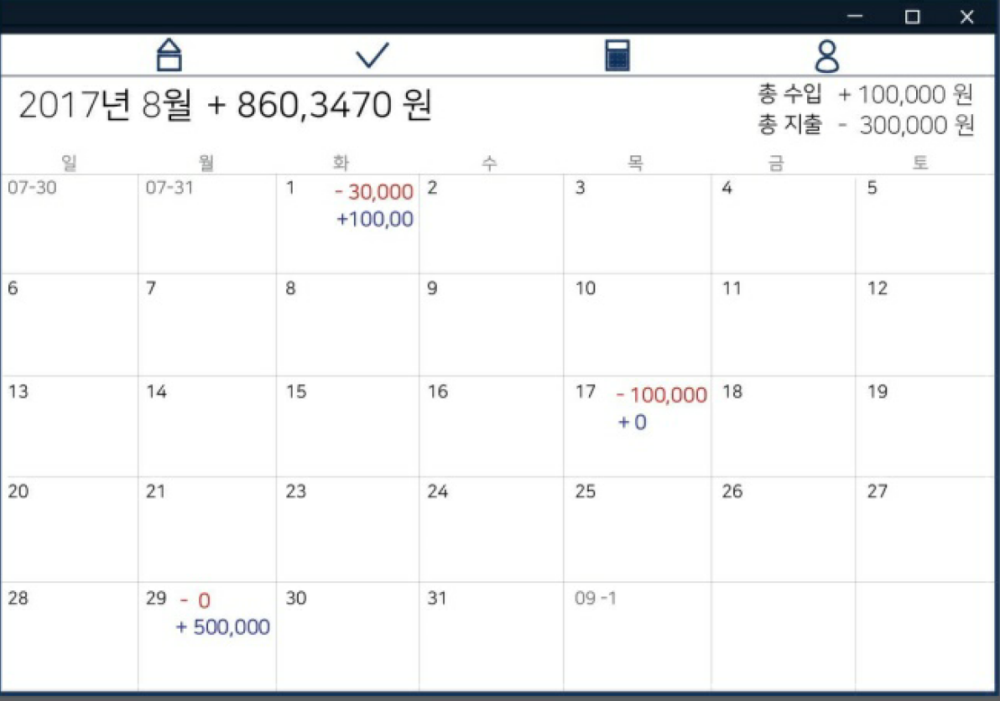
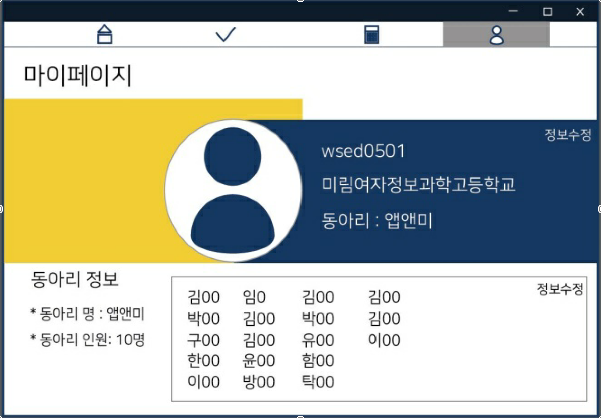

# AccountBook

고등학교 2학년때 만들었던 자바 수업 과제 "동아리 전용 회계 관리 PC App"

### Feature
1. 회원가입 및 로그인 기능
2. 수입 및 지출 저장
3. 수입 및 지출, 총액을 달력을 통해 날짜 별로 보여준다.
4. 동아리 부원들과 더치페이할 때 사용하는 더치페이 계산기
5. 해당 달의 수입 및 지출 내역을 Facebook 게시글로 공유 (자동화)
6. 마이페이지 기능 (정보 수정)

### Skills
    - Java
    - Firebase
    - Facebook API
    
### Tools
    - Eclipse
